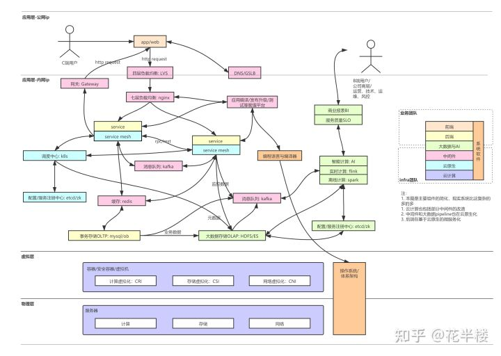

# 互联网技术栈

## 前言
本图能帮助 学生党、或者工作年限不多、或者深挖单个领域的小伙伴对整个互联网技术领域形成全面的认知。

    图中各个示例给的开源软件就是各个大厂真实在用的，大厂没啥特殊的，只是内部二次开发进行包装，核心还是开源的那些东西。

    所以，破除大厂迷信，吃透开源组件原理，实力不会比谁差。

## 技术栈一览

# 技术栈
互联网大厂岗位主要分为两种：

- 业务开发
- infra开发

### 业务开发
主要包括：前端、后端以及部分大数据数据分析岗位。
前端不说了。
后端的技术主要是：
1. 应用业务逻辑开发
2. rpc/REST
3. 缓存，如redis
4. 事务存储，如mysql

### infra开发
主要包括五大类：云计算，云原生包括容器、调度等，中间件，大数据与AI以及系统软件。

云计算：
1. 计算虚拟化，如kvm
2. 存储虚拟化，如容器的csi
3. 网络虚拟化，如ipvlan和vxlan等

云原生：
1. 容器，如docker
2. 调度中心，如k8s
3. 服务网格，如istio

中间件：
1. DNS，如GSLB
2. 网关，如api gateway
3. 负载均衡，如LVS和ngnix
4. 消息队列，如kafka
5. 缓存，如redis
6. 配置、服务注册中心，如ectc、zk
7. 应用编译、发布、测试平台等

大数据平台与AI：
1. 数据采集，主要包括元数据、业务数据和监控数据
2. 大数据存储，如hdfs和elasticsearch等
3. 离线计算，如spark
4. 实时计算，如flink、spark streaming
5. 全文检索，如elasticsearch
6. 智能计算，如pytorch和params server等
7. 可视化，如商业报表工具

系统软件：
这就相当硬核了，没几个公司能搞，主要包括：
1. 操作系统
2. 编程语言与编译器

每块技术栈其实深挖东西都很多，而且都是不断演进的，能够持续干下去。
不要被35岁裁员吓退，真正的技术专家永远是稀缺的。