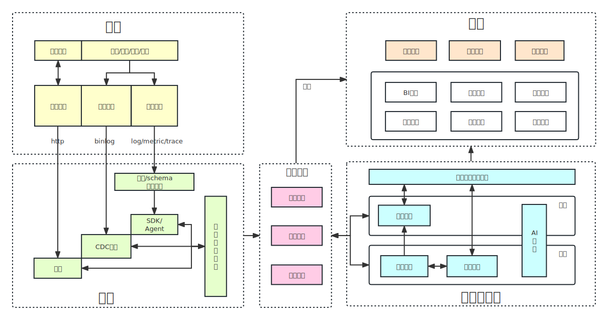

# 大数据pipeline最佳实践

## 前言

一张图 写清楚大数据pipeline的最佳实践，图中有的部分是大家熟知的，有的则是我从纷繁的细节中总结出来的，希望能给大家带来帮助。

我会按照 生产、采集、加工和消费四个环节分别来讲解。

看着图，每个人都能说几句。但要真要让自己把自己公司里的大数据链路梳理清楚，那也不是那么容易的。而且现实比图中复杂的多，基本上每个出现的工具每个公司都会有两三套，然后数据采集和消费链路被割裂开，这也是我在阿里的深刻体会，当然演进的方向也很清晰，方向就是图中列出来的。

## 生产

任何一个公司产生的数据基本都可以分为上述给出的三类：**外部数据、业务数据、监控数据**，这样区分的原因不只是因为数据本身类型不同，更是因为对于这三类数据的采集方式差别较大。

- **外部数据**：指的是 通过爬虫在互联网获取的公开数据，一般会写到db或日志存储中。
- **业务数据**：指的是 应用、平台和系统为了实现自身功能和对外服务产生的数据，不只是对外服务的应用，内部应用以及平台产生的这种数据也属于业务数据，这种数据一般也是存储在db表里。
- **监控数据**：指的是 为了观察应用、平台和系统提供服务的运行时状态等额外采集的数据，比如页面访问次数、cpu利用率等，这种数据落盘时一般存为metric/log/trace，通过云原生的数据链路吐出到最终的存储中。

## 2. 采集

- **外部数据采集**：不是关键不展开。
- **业务数据采集**：业务数据的更新频率和数据量差别非常大，所以，采集的方式一般是通过cdc组件检测数据库binlog的变动，进行增量式的采集，数据是实时的。
- **监控数据采集**：监控数据是无中生有，公司一般会建立埋点或者schema管理平台来控制此类数据的采集，埋点指的是在哪个位置进行采集，schema指的是采集格式和版本的控制。采集的方式 一是采用侵入式的sdk进程代码级指标采集，比如页面访问次数、端口访问次数等。二是 容器或者物理机上的部署agent进行资源利用指标的采集，比如CPU利用率和内存占用率等。一般按照metric/log/trace三种格式输出，输出的数据会直接进入数据总线，也是实时的。

## 3. 存储与计算

存储与计算分为两条通道，一是实时， 二是离线。

- **实时计算**：比如spark streaming和flink等，它们是为了支持实时任务而开发建设的计算工具，比如抖音的视频推荐、淘宝的衣物推荐等都需要依赖强大的实时计算能力进行实时服务。
- **离线存储与计算**：这个 不多说了，大家应该都很熟悉，绝大部分任务其实都是在离线存储上用离线计算引擎完成的。
- **AI平台**：AI平台也分为实时和离线，不展开了
- **统一数据开发平台**：这个平台是每个公司平台建设的重中之重，它的好用与否基本决定了每一个数据研发、算法、运维和运营的工作效率如何。

## 4. 数据总线

数据总线本来应该放进存储与计算板块里的，但鉴于其重要性以及好多pipeline都忽视了这个功能的重要性，所以我把它单拎出来讲一讲。

对于采集功能来说，不管是哪种数据，都需要在容器或者物理机上加agent，数据总线相当于各类数据源的汇聚点，方便后续实时和离线计算使用。

但上述理由其实只是其一，可以看到我从数据总线上拉了一条链路到消费板块，这正是数据总线的独特性。

**消费的数据并不一定要经过实时计算或离线计算，有的应用对数据的实时性要求极高，而实时计算又太重，我之前就开发过一个数据采集系统基本不能用任何实时计算引擎，因为数据必须在几百ms内必须被消费到，否则数据将没有任何意义。**

因此，数据产生时就基本需要满足使用时的样子，然后要能被立即消费到。这就是数据总线要单拉出来的另一个理由。

另外，另一种实时计算无法满足的实时性任务是实时搜索和查询，数据总线通过加各种正反排索引的能力以提供实时查询的能力。

所以，大家在建设大数据pipeline的时候，不要忘记这两种场景，如果有的话，带有索引能力的数据总线可能会是一个不错的解决方案。

## 5. 消费
消费场景其实说起来就三种： 
- **线上应用**：某个应用需要用到其他应用产生的数据、执行业务流程，不管是实时的还是离线的
- **商业分析**：商业分析一般指的是分析服务、产品或公司在市场上的竞争力，从营收、成本等多个角度分析
- **产品质量/效率**：产品质量/效率指的是如何衡量、提升产品与服务的质量和效率

消费板块也是各个公司最混乱的，各种重复建设，因为其不能像数据开发平台那样一个公司建设一套，这一块可以见到各种各样的小平台，都号称业务中台。

当然也不是每一种小平台都是为了平台而平台（为了kpi），以下几种平台我觉得还是很有必要建设的：
- **BI平台**：商业分析和报表生成平台
- **链路平台**：描述典型对外业务完整链路，比如 可视化web前端->后端应用->其他应用->容器->内核->物理机等的端到端链路过程，可用于链路优化、链路扩容、核心应用高可用保障等等。
- **监控平台**：更多的是针对 各种统计指标的监控，提前告警以及辅助定位根因。
- **运维平台**：主要针对的是变更，变更是一切风险的源头，所以要对生产应用的每一点变更进行最为细粒度的把控。
- **风控平台**：主要对 各种作弊、欺诈、信誉等现象或信息进行管控
- **安全平台**：主要对 影响公司信息安全、隐私甚至服务质量的外部恶意攻击进行防护