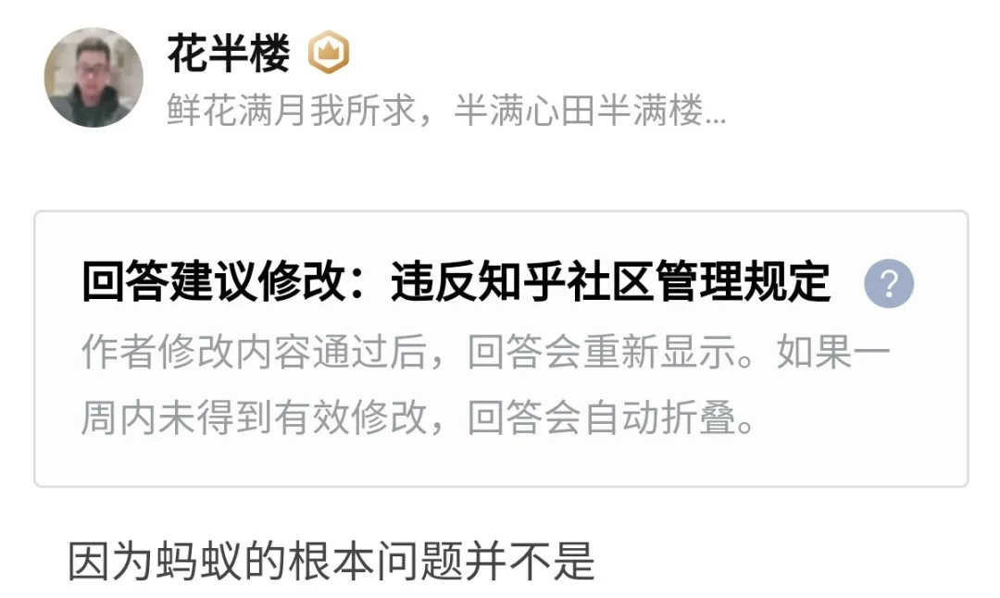

**本篇文章来自于我的一个高赞回答。**

**被河蟹了，肯定抢救不回来了。**

**哎，不管对方说的对不对，不给人说话总不太对吧。**

因为蚂蚁的根本问题并不是

网上传的沸沸扬扬的 什么一百倍高杠杆问题，也不是什么花呗借呗剥削年轻人问题。

蚂蚁的杠杆首先并不高，事实上只有五六倍，且都在银行的资产负债表里，是经过监管的。

花呗借呗也并没有增加多少年轻人负债率，毕竟就是个方便使用的信用卡，这种负债比起房贷导致居民部门负债率暴增九牛一毛。

**本质问题是边界问题和路线问题，也就是马云在外滩大会上争论的问题。**

**一、边界问题**

边界说的是 私企到底能够介入到国家金融核心什么层次的问题？

王朝历史周期律现在越来越多的专业分析认为是金融周期导致的，金融是真正的国家命脉。

银行是国有企业，资产是国有资产，所有制是公有制，可控。

但私企可以介入到金融核心的交易数据、信用数据什么程度？（蚂蚁对信用和风险重新量化的过程弱化了银行的职能，对C端交易入口的掌控以及数据的丰富和隐私程度比银行更甚。）

不知道。

但保守点比较好，蚂蚁上市成为巨头，与政府议价能力暴增，政府做起事来会畏手畏脚。

**二、路线问题**

路线问题说的是

政府到底是为人民服务还是为资本服务的问题。

在企业导向上到底是完全的允许私企利润最大化，还是在整个社会生态中的共赢问题。

蚂蚁在科创板能拿到688688代号，蚂蚁的各种微贷、数金、支付能起来，说明上层是支持的。

但蚂蚁上市被紧急叫停，说明顶层是认为有些问题是还需要理清楚的。

犹豫纠结、甚至争论的是顶层。

蚂蚁处在国家命脉的金融核心，蚂蚁也是整个社会生态的一员。

在核心里，要明确自己的边界。

在生态中，要知道共赢才能长久。

---

**补充一：**

统一解答几个不是问题的问题：

**1. abs是什么？**

蚂蚁把手里的现金假设1亿贷给用户，利率6%，约定1年还清。但蚂蚁觉得1年太长，就把这个贷款转给了银行，利率5%，银行把1亿还给蚂蚁。从结果来看，真正的债权方是银行，债务方是用户，蚂蚁只是中介赚了1%的手续费。由于蚂蚁的风控也即找的用户比银行自己找的还好，所以坏账率比银行自己借出去还低。

**2. 蚂蚁abs杠杆到底是多少？**

蚂蚁小贷公司净资产380亿左右，截止到二季度abs不到两千亿，都是公开信息。算这个杠杆率是5倍，符合abs的规定。abs的规定早就有了，蚂蚁也早就合规了，这次网上炒作的的什么30 3000 100倍杠杆就是自媒体无脑黑言论。  
**3. 蚂蚁小贷两万亿贷款余额，是50倍杠杆？**  
蚂蚁的abs只有不到两千亿，剩下的是所谓的联合贷和助贷，你可以认为类似于合伙开公司，要么出资要么出技术。有人说蚂蚁400亿撬动2万亿，50倍杠杆，我还是说这样算很不公平而且很无聊。一，大家都知道，技术牛人可以技术入股公司，因为技术也是资本，技术是第一生产力。蚂蚁出的就是技术和部分资金，你不能说支付宝给大家提供的便利服务形成的技术能力和用户不值钱吧，要这样说，没有人去搞技术了，技术、资金都是资本，所以，直接算资金资本不算技术资本对蚂蚁不公平。二，银行并不是瞎子，绝大部分贷款，蚂蚁只是提供对象和初筛，银行还要筛一遍，风险是经过双重评估的，风险也不是说全来自蚂蚁。  
本次小贷规定限制的就是这种联合贷款出资比例，是一种没有任何参考的新的监管，蚂蚁合法合规，监管也没有问题。  
**4.蚂蚁小贷是不是次贷？**  
这相当于是问信用卡是不是次贷。  
一，花呗绝大多数人当成信用卡用，很少人会真的产生逾期，逾期利息跟大部分银行信用卡一样，七八个点。借呗的利率确实高，这一点是值得喷的，但借呗的额度甚至比不上一些大额信用卡。借呗的意义也是填补银行只向大客户贷款，歧视部分个体经营用户的空白。  
二，美国次贷危机的原因一是超大额房贷，二是好坏标的混卖，中国难道不吸取这个教训？蚂蚁的abs规模被限制，也是经过分层的，没有混合。  
三，蚂蚁的违约率并不比银行高，总额度也比银行信用卡规模小很多，经过蚂蚁和银行双重审核。很多人逮着蚂蚁说蚂蚁的社会完蛋全赖你？你觉得合理吗？

国内信用卡贷款余额10万亿左右，房贷余额50万亿以上，以支付宝体量促成的贷款规模风险并不大，风险不在这里。

**5. 银行不借钱的用户借钱就是伪需求吗？**

咱们都是平头百姓，向亲朋好友都借过钱，人情不好拉，借钱需求是真实存在的。银行的一个大问题是躺赚，所以不愿意多事，它喜欢向大国企和地方政府、大企业借钱，因为安全。向很多小微企业，个体则是审核非常严，过程繁琐要跑腿提交的材料多，这也是央妈流动性流不下去的大问题。小贷和银行是互相补充的，取缔小贷，最后对我们自己未必有好处。  
**6.蚂蚁的问题真的是所谓的杠杆问题吗？**  
蚂蚁的杠杆问题，无非是贷款贷多了，那好，它之后少贷点，降到合乎监管的标准，这个做到很简单。  
很多人死盯着这个问题喷，那么请问到这里是不是万事大吉了？  
并不是，回过头去，再去看我文中阐述的两个问题。