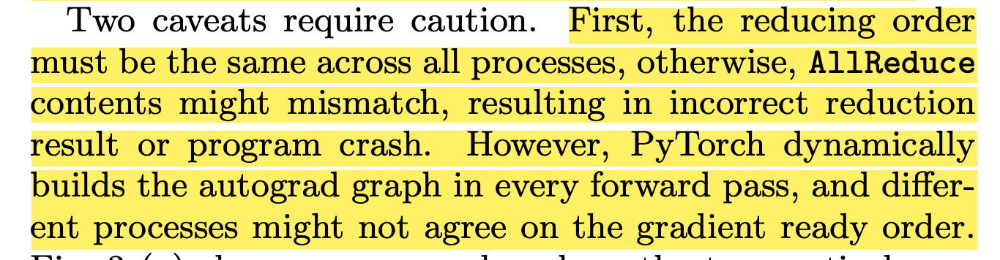
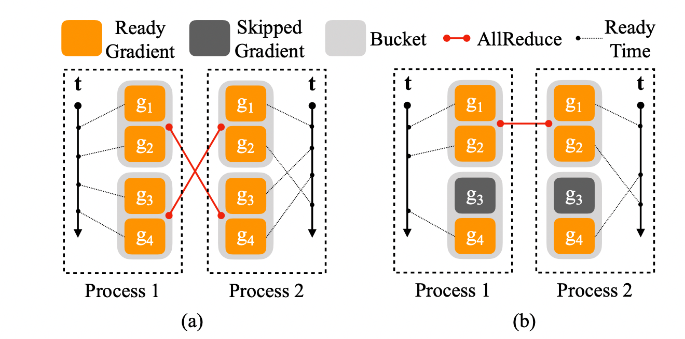
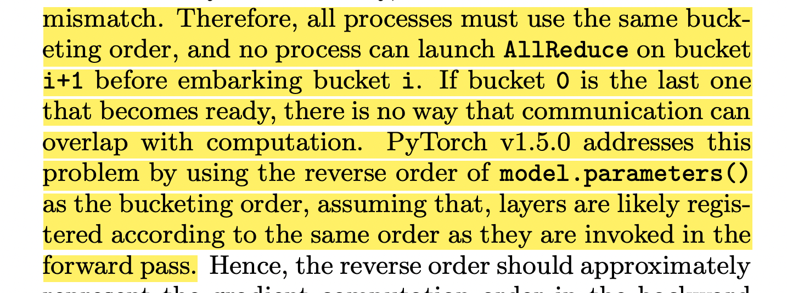
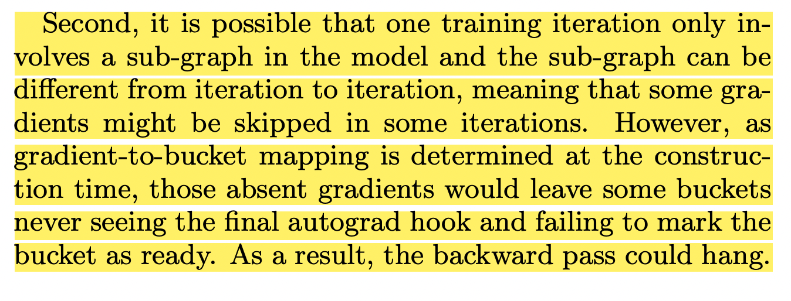
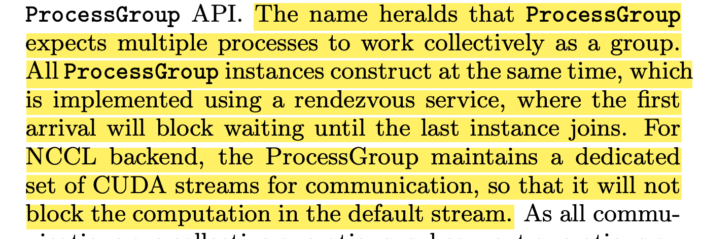
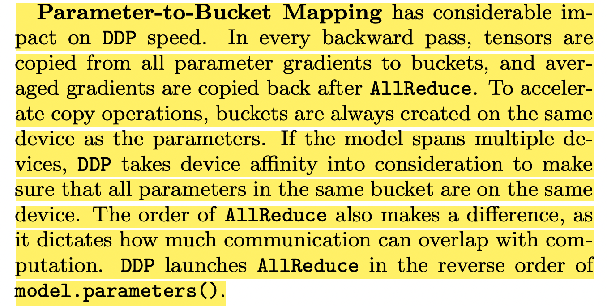

Paper: [https://arxiv.org/abs/2006.15704](https://arxiv.org/abs/2006.15704)

## 摘要

聚焦分布式数据并行 DistributedDataParallel

下图为DDP的伪代码，非常精炼易于理解。

[https://github.com/pytorch/pytorch/blob/main/torch/nn/parallel/distributed.py](https://github.com/pytorch/pytorch/blob/main/torch/nn/parallel/distributed.py)

## 介绍

训练三步骤：

1. forward to get loss
2. backward to get gradient
3. optimize parameters

要解决三个问题：

1. 数据一致性，不同模型副本数学上保持一致
2. API保持无打扰
3. 高性能

## 主要工作

1. 为了保持数学一致性，首先模型初始值都相同

2. 为了保持数据一致性，每个模型副本的梯度要保持一致

3. 之所以不直接对参数进行allreduce，有以下几点原因

4. 影响模型精度，因为参数直接平均不数学等价于所有数据本地处理，尤其是当优化器依赖之前的本地梯度相关参数，例如动量momentum，因此优化器会变得diverge，导致梯度方向冲突，最终导致模型结果不佳。
5. backward pass和通信无法重叠，导致无法优化到最优

### 梯度桶 Gradient Bucketing

并非每个参数tensor的梯度计算都是立即发起一次集合通信，多个参数tensor的梯度同一发起，效率更高

### 计算通信并行 Overlap Computation with Communication

更灵活的触发AllReduce，每个参数tensor有一个gradient累积器，每个累积器属于一个gradient bucket，一旦bucket里的累积器都更新了，则立即触发异步的AllReduce。

### 第一个要注意的点

由于每个进程的动态构造梯度传播图，参数梯度ready的顺序未必一致。如下图A，process2的g2在时间线上ready更慢，如果按照bucket梯度都ready就触发，那么g3和g4所在的bucket就会先触发，导致错位甚至错误。因为bucket一定要按序触发，即使后面的bucket先ready，这个顺序是按照参数顺序的反序给定的。

### 第二个要注意的点

由于模型的动态性，某些层可能会不被使用，如上图的b图，g3参数和梯度没有被使用，但bucket是在初始化时划分好的，这会导致其所在的bucket不会触发，导致hang。

解法是遍历autograd去发现真正的使用的参数，并标记出来，只关注这些参数梯度是否ready。

### 集合通信

进程组构造要同步完成，互相等待。且持有一组充足的cuda stream，防止被阻塞。

如果一个模型参数跨多个设备，会做亲和性，确保同一个bucket里的参数梯度都在同一个设备上。

