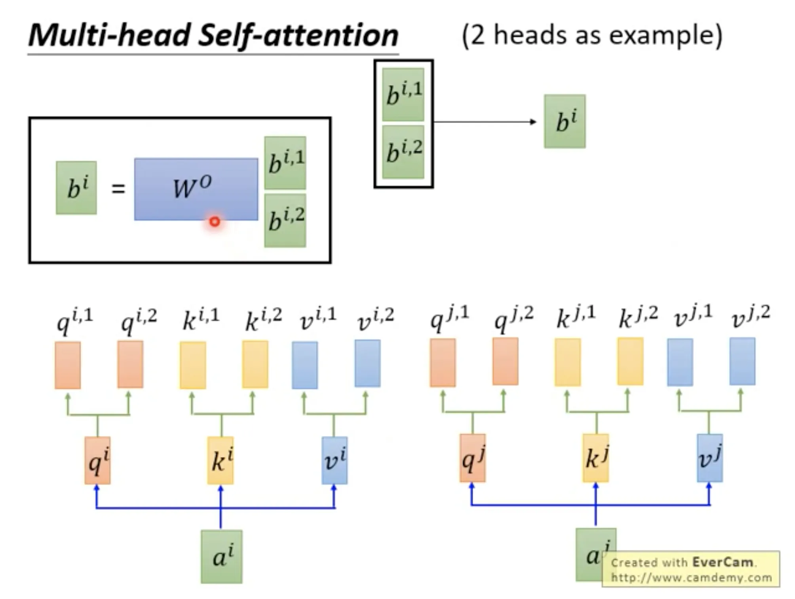
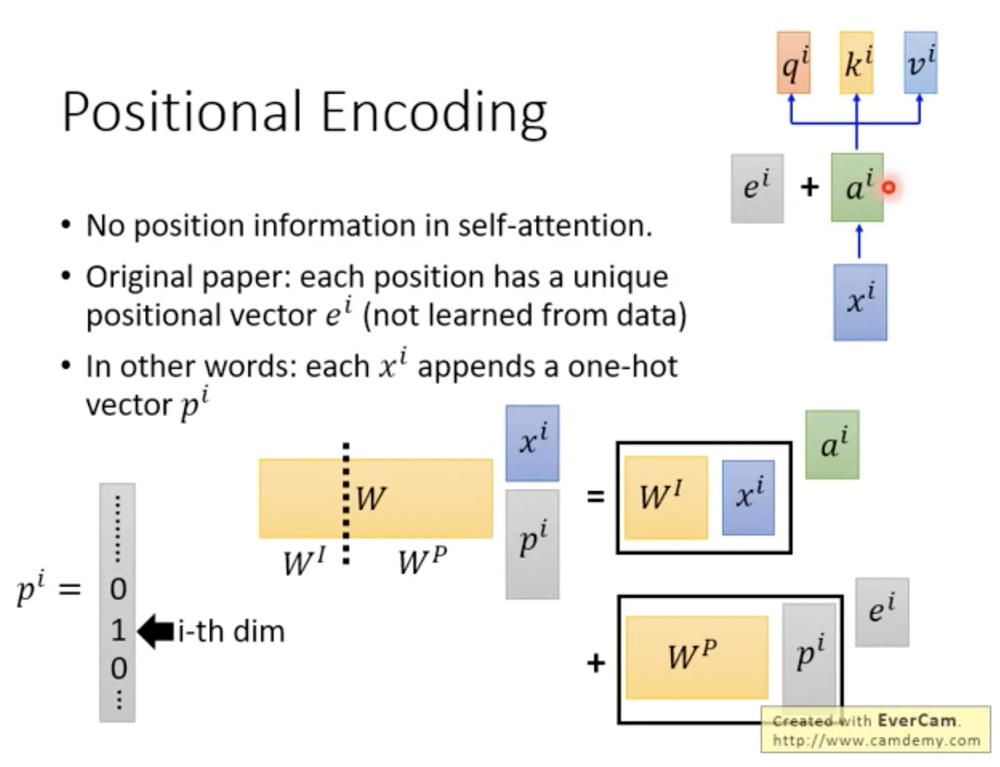
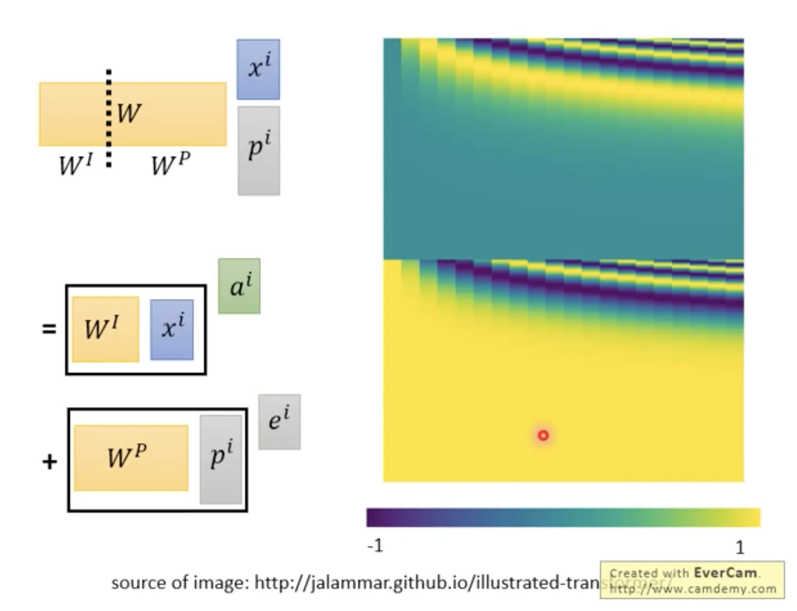
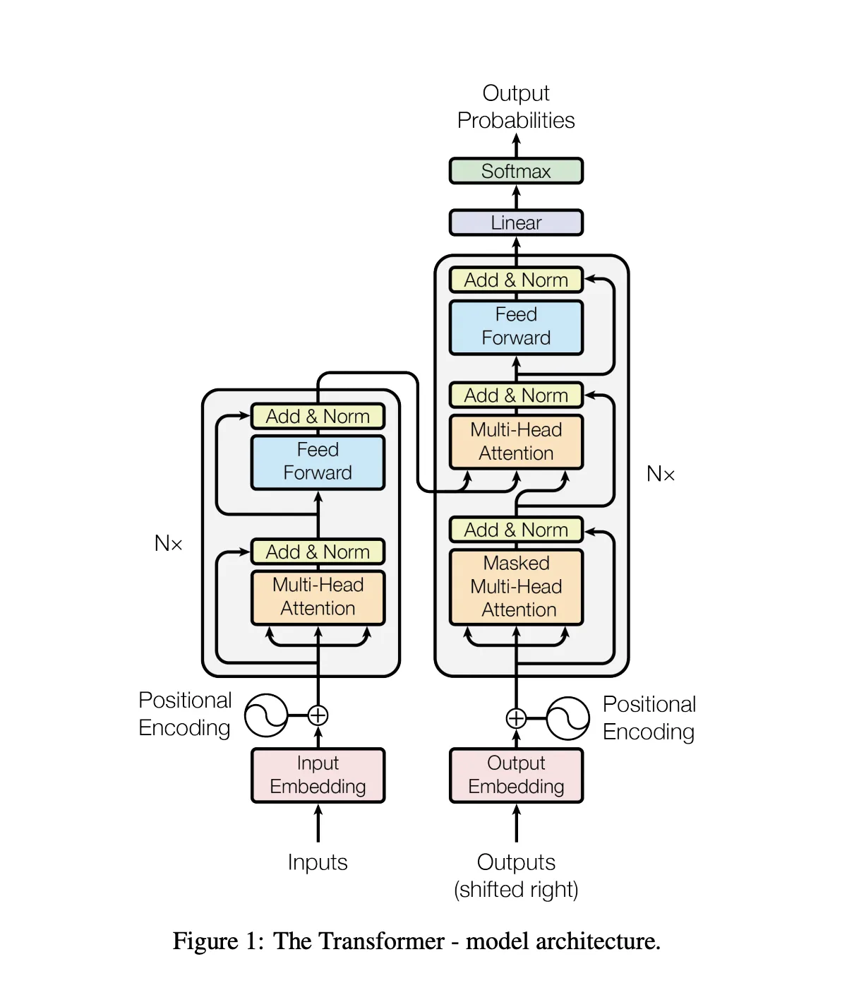
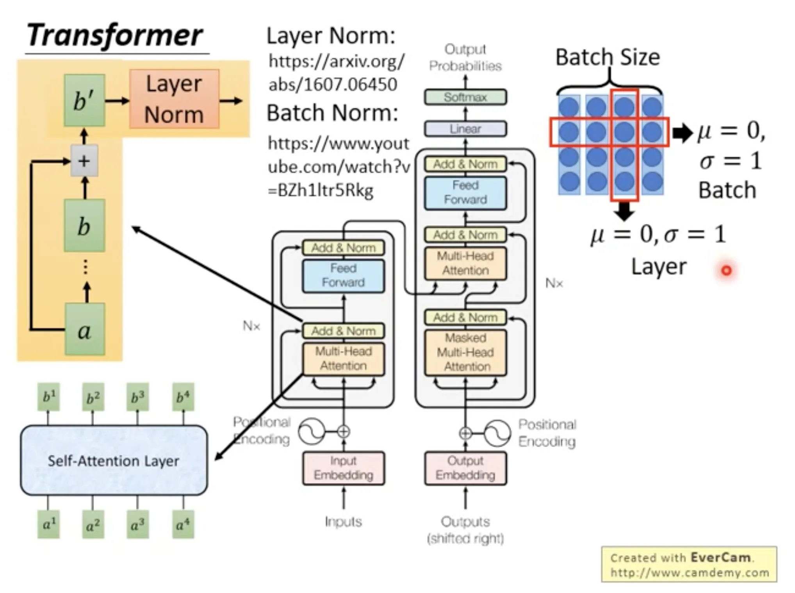

# 1. 论文和课程

- [https://arxiv.org/abs/1706.03762](https://arxiv.org/abs/1706.03762)
- [https://www.youtube.com/watch?v=ugWDIIOHtPA&list=PLJV_el3uVTsOK_ZK5L0Iv_EQoL1JefRL4&index=61](https://www.youtube.com/watch?v=ugWDIIOHtPA&list=PLJV_el3uVTsOK_ZK5L0Iv_EQoL1JefRL4&index=61)

# 2. QKV

# 3. Attention

# 4. Softmax

# 5. Vector Sum

# 6. 矩阵运算大图

# 7. Multi-head

# 8. Positional Encoding

# 9. Seq1seq with attention

