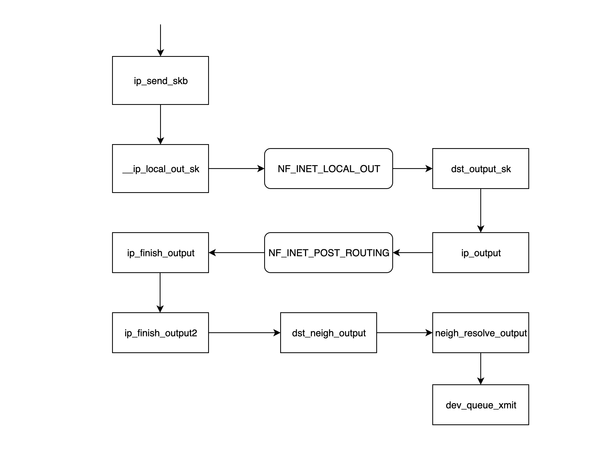
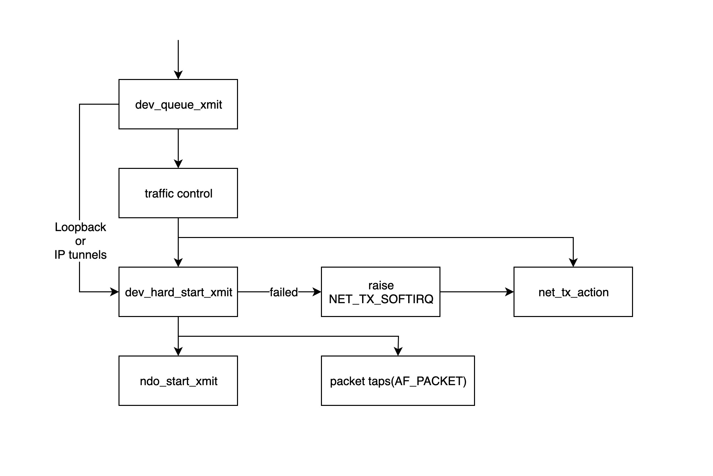

参考：[https://morven.life/posts/networking-1-pkg-snd-rcv/](https://morven.life/posts/networking-1-pkg-snd-rcv/)

这篇更为详尽：[Linux 网络栈接收数据（RX）：原理及内核实现（2022）](http://arthurchiao.art/blog/linux-net-stack-implementation-rx-zh/)

## 数据包的接收过程

为了简化起见，我们以一个 UDP 数据包在物理网卡上处理流程来介绍 Linux 网络数据包的接收和发送过程，我会尽量忽略一些不相关的细节。

## 从网卡到内存

我们知道，每个网络设备（网卡）有驱动才能工作，驱动在内核启动时需要加载到内核中。事实上，从逻辑上看，驱动是负责衔接网络设备和内核网络栈的中间模块，每当网络设备接收到新的数据包时，就会触发中断，而对应的中断处理程序正是加载到内核中的驱动程序。

下面这张图详细地展示了数据包如何从网络设备进入内存，并被处于内核中的驱动程序和网络栈处理的：

1. 数据包进入物理网卡，如果目的地址不是该网络设备，且该网络设备没有开启[混杂模式](https://unix.stackexchange.com/questions/14056/what-is-kernel-ip-forwarding)，该包会被该网络设备丢弃；
2. **物理网卡将数据包通过 DMA 的方式写入到指定的 ringbuffer （预先分配好的内存）**，该地址由网卡驱动分配并初始化；这是一次数据复制；
3. 物理网卡通过**触发硬件中断（IRQ）通知 CPU**，有新的数据包到达物理网卡需要处理，在 MSI-X 场景，中断和 RX 队列绑定；如果已经处于 NAPI Poll 中，则会被直接读取；
4. 接下来 CPU 根据中断表，**调用已经注册了的中断函数（驱动）**，这个中断函数是在驱动模块初始化时注册的。这个函数会调用 `**napi_schedule（驱动）**` **进而调用**`**__raise_softirq_irqoff(内核)**`**触发一个NET_RX_SOFTIRQ 类型的软中断**；
5. `ksoftirqd`进程负责处理软中断，其调用run_ksoftirqd -> local_irq_disable禁用所在 CPU的所有硬件中断，表示驱动程序已经知道内存中有数据了，告诉物理网卡下次再收到数据包直接写内存就可以了，不要再通知 CPU 了，这样可以提高效率，避免 CPU 不停地被中断；
6. 软中断调用 `**__do_softirq**`**到**`**net_rx_action（内核）**` **继续处理数据包**，处理完成，调用local_irq_enable 打开硬中断。 这样做的原因是硬中断处理程序执行的过程中不能被中断，所以如果它执行时间过长，会导致 CPU 没法响应其它硬件的中断，于是内核引入软中断，这样可以将硬中断处理函数中耗时的部分移到软中断处理函数里面来慢慢处理；

### 内核处理数据包

上一步中网络设备驱动程序会通过触发内核网络模块中的软中断处理函数，内核处理数据包的流程如下图所示：

7. 对上一步中驱动发出的软中断，内核中的 ksoftirqd 进程会调用网络模块的相应软中断所对应的处理函数，确切地说，这里其实是调用 `net_rx_action` 函数；
8. 接下来 `net_rx_action` **调用** `**napi_poll**`**（驱动） 函数来一个个地处理数据包**；
9. 而 `poll` 函数会让驱动程序读取网卡写到内存中的数据包，事实上，内存中数据包的格式只有驱动知道；
10. 驱动程序基于数据包**创建内核网络栈能识别的 skb(socket buffer) 格式**，这又是一次数据复制，然后调用 `**napi_gro_receive**`**（内核）来进行包合并， 正式开启网络栈处理逻辑**；
11. `napi_gro_receive` 函数会处理 [GRO](https://lwn.net/Articles/358910/) 相关的内容，也就是将可以合并的数据包进行合并，这样就只需要调用一次协议栈，然后判断是否开启了 [RPS](https://github.com/torvalds/linux/blob/v3.13/Documentation/networking/scaling.txt#L99-L222)，如果开启了，将会调用 `enqueue_to_backlog` 函数；
12. `enqueue_to_backlog` 函数会将数据包放入 `input_pkt_queue` 结构体中，然后返回；如果 `input_pkt_queue` 满了的话，该数据包将会被丢弃，这个队列的大小可以通过 `net.core.netdev_max_backlog` 来配置；

Note：GRO 的主要思想都是通过合并“足够类似”的包来减少传送给网络栈的包数，这有 助于减少 CPU 的使用量。例如，考虑大文件传输的场景，包的数量非常多，大部分包都是一 段文件数据。相比于每次都将小包送到网络栈，可以将收到的小包合并成一个很大的包再送 到网络栈。GRO 使协议层只需处理一个 header，而将包含大量数据的整个大包送到用 户程序。

13. `**napi_gro_receive**`**处理完成调用** `**__netif_receive_skb_list**` **->** `**__netif_receive_skb_list_core**` **->** `**__netif_receive_skb_core**` 来处理 skb；
14. 如果没开启 RPS，`napi_gro_receive` 函数会直接调用 `**__netif_receive_skb_core**` 函数来处理网络数据包；
15. `**__netif_receive_skb_core**` 这里面做的事情非常多， 按顺序包括：

16. 处理 skb 时间戳；
17. Generic XDP：软件执行 XDP 程序（XDP 是硬件功能，本来应该由硬件网卡来执行）；
18. 处理 VLAN header；
19. TAP 处理：例如 tcpdump 抓包、流量过滤；
20. TC：TC 规则或 TC BPF 程序；
21. Netfilter：处理 iptables 规则等。

22. 将数据包通过 `**deliver_skb**`**（内核）指向** `**ip_rcv**` **交给内核 TCP/IP 协议栈处理**；

在协议栈初始化时 注册几种基础 L4 协议的 rx handler

- inet_add_protocol(&icmp_protocol, IPPROTO_ICMP)
- inet_add_protocol(&udp_protocol, IPPROTO_UDP)
- inet_add_protocol(&tcp_protocol, IPPROTO_TCP)
- inet_add_protocol(&igmp_protocol, IPPROTO_IGMP)

17. 当内存中的所有数据包被处理完成后（`poll`函数执行完成），重新启用网卡的硬中断，这样下次网卡再收到数据的时候就会通知 CPU

### 内核网络协议栈

内核 TCP/IP 协议栈此时接收到的数据包其实是三层(网络层)数据包，因此，数据包首先会首先进入到 IP 网络层，然后进入传输层处理。

#### IP 网络层

- `ip_rcv` 是函数是 IP 网络层处理模块的入口函数，该函数首先判断属否需要丢弃该数据包（目的 mac 地址不是当前网卡，并且网卡设置了混杂模式），**如果需要进一步处理就调用注册在 netfilter 中的 NF_INET_PRE_ROUTING 这条链上的处理函数**；
- NF_INET_PRE_ROUTING 是 netfilter 放在协议栈中的钩子函数，可以通过 iptables 来注入一些数据包处理函数，用来修改或者丢弃数据包，如果数据包没被丢弃，将继续往下走；

NF_INET_PRE_ROUTING 等 netfilter 链上的处理逻辑可以通过 iptables 来设置，详情请移步至[从零开始认识 iptables](https://morven.life/posts/iptables-wiki/)

- `**routing**` **进行路由处理**，如果目的 IP 不是本地 IP，且没有开启 ip 转发功能，那么数据包将被丢弃；否则进入 `ip_forward` 函数处理；
- `**ip_forward**` **函数会先调用 netfilter 注册在 NF_INET_FORWARD 链上的处理函数**，如果数据包没有被丢弃，那么将继续往后调用 `dst_output_sk` 函数；
- `**dst_output_sk**` **函数会调用 IP 网络层的相应函数将该数据包发送出去**，这一步的具体步骤将会在下一章节发送数据包中详细介绍；
- `**ip_local_deliver**` **如果上面路由处理发现发现目的 IP 是本地 IP，那么将会调用** `**ip_local_deliver**` **函数**，该函数先调用 NF_INET_LOCAL_IN 链上的相关处理函数。
- 如果处理通过，数据包会通过协议字段选择 `**tcp_v4_rcv**` `**udp_rcv**``**icmp_send**`**继续处理**

#### 传输层

- `udp_rcv` 函数是 UDP 处理层模块的入口函数，它首先调用 `__udp4_lib_lookup_skb` 函数，根据目的 IP 和端口查找对应的 socket(所谓 socket 基本就是 ip+port 组成的结构体)，如果没有找到相应的 socket，那么该数据包将会被丢弃，否则继续；
- `sock_queue_rcv_skb` 该函数的职责一是检查 socket 的接收缓存是不是满了，如果满了的话就丢弃该数据包；二是调用 `sk_filter` 检查这个数据包是否是满足条件的包，如果当前 socket 上设置了 filter，且该包不满足条件的话，这个数据包也将被丢弃；
- `__skb_queue_tail` 函数将数据包放入 socket 接收队列的末尾；
- `sk_data_ready` 通知 socket 数据包已经准备好;
- 调用完 `sk_data_ready` 之后，一个数据包处理完成，等待应用层程序来读取；

Note: 上面所述的所有执行过程都在软中断上下文中执行。

---

## 数据包的发送过程

从逻辑上看，Linux 网络数据包的发送过程和接收过程正好相反，我们仍旧以一个 UDP 数据包通过物理网卡发送的过程为例来讲解：

### 应用层

应用层处理过程的起点是应用程序调用 Linux 网络接口创建 socket，下面这张图详细地展示了应用层如何构建 socket 并发送给传输层：

- `socket(...)` 调用该函数来创建一个 socket 结构体，并初始化相应的操作函数；
- `sendto(sock, ...)` 应用层程序调用该函数开始发送数据包，该函数会调用后面的 `inet_sendmsg` 函数；
- `inet_sendmsg` 该函数主要是检查当前 socket 有没有绑定源端口，如果没有的话，调用 `inet_autobind` 函数分配一个，然后调用 UDP 层的函数进行传输；
- `inet_autobind` 函数会调用 `get_port` 函数获取一个可用的端口；

### 内核网络协议栈

#### 传输层

- `udp_sendmsg` 函数是 UDP 传输层模块发送数据包的入口。该函数中先调用 `ip_route_output_flow` 函数获取路由信息（主要包括源 IP 和网卡），然后调用 `ip_make_skb` 构造 skb 结构体，最后将网卡信息和该 skb 关联起来；
- `ip_route_output_flow` 函数主要处理路由信息，它会根据路由表和目的 IP，找到这个数据包应该从哪个网络设备发送出去，如果该 socket 没有绑定源 IP，该函数还会根据路由表找到一个最合适的源 IP 给它。 如果该 socket 已经绑定了源 IP，但根据路由表，从这个源 IP 对应的网卡没法到达目的地址，则该包会被丢弃，于是数据发送失败将返回错误。该函数最后会将找到的网络设备和源 IP 塞进 `flowi4` 结构体并返回给 `udp_sendmsg` 函数；
- `ip_make_skb` 函数的功能是构造 skb 包，构造好的 skb 包里面已经分配了 IP 包头(包括源 IP 信息)，同时该函数会调用 `__ip_append_dat` 函数对数据包进行分片，同时还会在该函数中检查 socket 的发送缓存是否已经用光，如果被用光的话，返回 `ENOBUFS` 错误信息；
- `udp_send_skb(skb, fl4)` 函数主要是往 skb 里面填充 UDP 的包头，同时处理校验值，然后交给 IP 网络层的相应函数处理；

#### IP 网络层

- `ip_send_skb` 是 IP 网络层模块发送数据包的入口函数，该函数主要是调用后面的一系列的函数来发送网络层数据包；
- `__ip_local_out_sk` 函数用来设置 IP 报文头的长度和校验值，然后调用下面 netfilter 钩子链 NF_INET_LOCAL_OUT 上注册的处理函数；
- **NF_INET_LOCAL_OUT 是 netfilter 钩子关卡，可以通过 iptables 来配置链上的处理函数**；如果该数据包没被丢弃，则继续往下走；
- `dst_output_sk` 该函数根据 skb 里面的信息，调用相应的 output 函数 `ip_output`；
- `ip_output` 函数将上一层 `udp_sendmsg` 得到的网卡信息写入 skb 然后调用 netfilter 钩子链 NF_INET_POST_ROUTING 上注册的处理函数；
- **NF_INET_POST_ROUTING 是 netfilter 钩子关卡，可以通过 iptables 来配置链上的处理函数**；在这一步主要是配置了原地址转换（SNAT），从而导致该 skb 的路由信息发生变化；
- `ip_finish_output` 函数判断经过了上一步的处理之后路由信息是否发生变化，如果发生变化的话，需要重新调用 `dst_output_sk` 函数（重新调用这个函数时，可能就不会再走到 `ip_output` 函数调用的分支，而是走到被 netfilter 指定的 output 函数，这里有可能是 xfrm4_transport_output），否则接着往下走；
- `**ip_finish_output2**` **函数根据目的 IP 到路由表里面找到下一跳(nexthop)的地址**，
- **调用** `**__ipv4_neigh_lookup_noref**` **函数去 arp 表里面找下一跳的 neigh 信息，没找到的话会调用** `**__neigh_create**` **函数构造一个空的 neigh 结构体；**
- `dst_neigh_output` 函数调用 `neigh_resolve_output` 函数获取 neigh 信息，并将信息里面的 mac 地址填到 skb 中，**然后调用** `**dev_queue_xmit**` **函数发送数据包；**

### 内核处理数据包

- `**dev_queue_xmit**` **函数是内核模块开始处理发送数据包的入口，该函数会先获取设备对应的 qdisc**，如果没有的话（如 loopback 或者 IP tunnels），就直接调用 `dev_hard_start_xmit` 函数，否则数据包将经过 traffic control 模块进行处理；
- traffic control 模块主要对数据包进行过滤和排序，如果队列满了的话，数据包会被丢掉，详情请参考: http://tldp.org/HOWTO/Traffic-Control-HOWTO/intro.html
- `dev_hard_start_xmit` 函数先拷贝一份 skb 给“packet taps”(tcpdump 命令的数据就从来自于此），**然后调用** `**ndo_start_xmit**` **函数来发送数据包。**如果 `dev_hard_start_xmit` 函数返回错误的话，调用它的函数会把 skb 放到一个地方，然后抛出软中断 NET_TX_SOFTIRQ 交给软中断处理程序 `net_tx_action` 函数稍后重试处理；
- `**ndo_start_xmit**` **函数绑定到具体驱动发送数据的处理函数；**`ndo_start_xmit` 函数会指向具体的网卡驱动发送数据包的函数，这一步之后，数据包发送任务就交给网络设备驱动程序了，不同的网络设备驱动有不同的处理方式，但是大致流程基本一致：

1. 将 skb 放入网卡自己的发送队列
2. 通知网卡发送数据包
3. 网卡发送完成后发送中断给 CPU
4. 收到中断后进行 skb 的清理工作

## 总结

理解了 Linux 网络数据包的接收和发送流程，我们就可以知道在哪些地方监控和修改数据包，哪些情况下数据包可能被丢弃，特别是了解了 netfilter 中相应钩子函数的位置，对于了解 iptables 的用法有一定的帮助，同时也会帮助我们更好的理解 Linux 下的网络虚拟设备。

## 参考

- [https://blog.packagecloud.io/eng/2016/06/22/monitoring-tuning-linux-networking-stack-receiving-data/](https://blog.packagecloud.io/eng/2016/06/22/monitoring-tuning-linux-networking-stack-receiving-data/)
- [https://blog.packagecloud.io/eng/2016/10/11/monitoring-tuning-linux-networking-stack-receiving-data-illustrated/](https://blog.packagecloud.io/eng/2016/10/11/monitoring-tuning-linux-networking-stack-receiving-data-illustrated/)