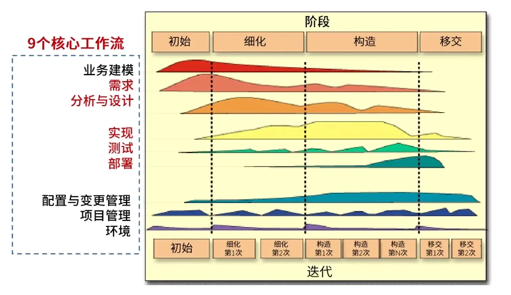
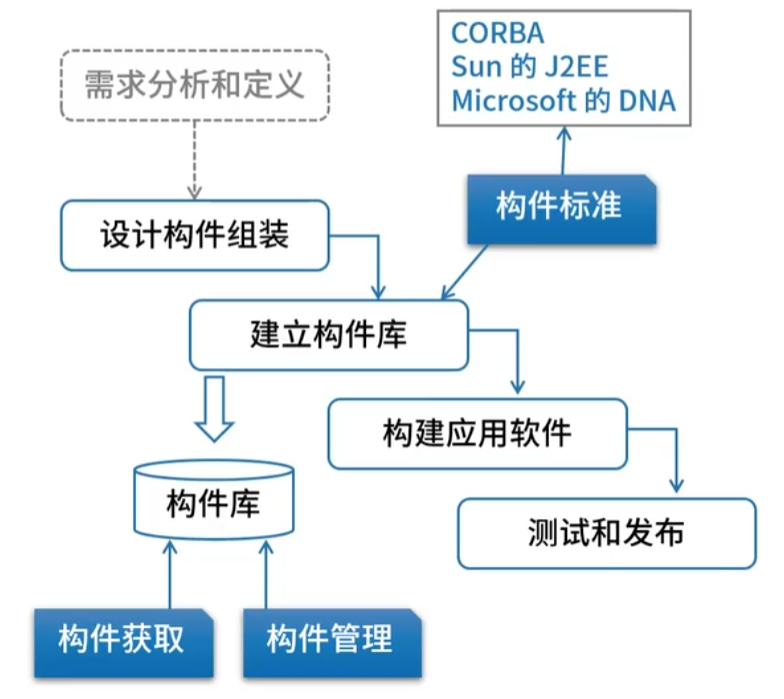
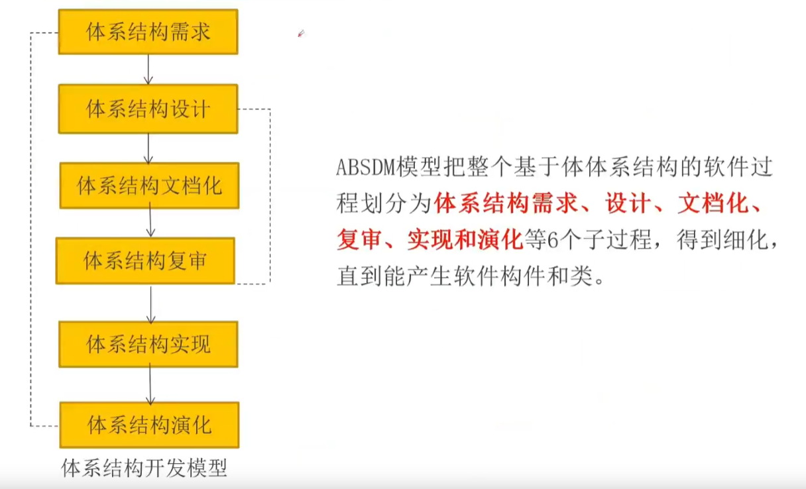
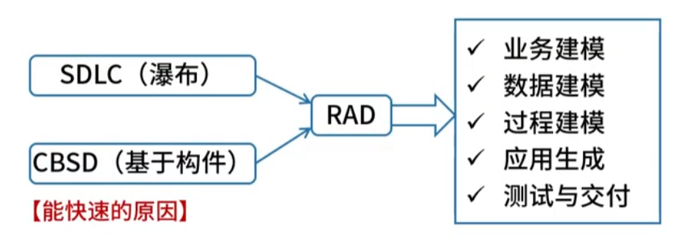

|                                     |                                                                       |                                                                                                                                                                                                                |                                                                                       |
| ----------------------------------- | --------------------------------------------------------------------- | -------------------------------------------------------------------------------------------------------------------------------------------------------------------------------------------------------------- | ------------------------------------------------------------------------------------- |
| 大类                                  | **名称**                                                                | **核心特征**                                                                                                                                                                                                       | **缺点**                                                                                |
| 传统计划驱动模型  - 计划驱动的顺序执行         | 瀑布模型 Waterfall Model                                                  | 一系列活动严格依次执行                                                                                                                                                                                    | 1. 需求的完整性、正确性难以确认，主要原因在于用户需求的不确定性 2. 串行执行，如果出现与需求不一致难以及时变更 3. 要求每个阶段都完全解决，现实中很难 |
|                                     | V 模型  - 基于瀑布模型                                                  | 研发和测试阶段一一对应  用于需求非常明确、稳定、且对可靠性和安全性要求极高的领域                                                                                                                                                | 把测试作为编码之后的一个活动，不利于尽早的发现bug，测试风险大                                                      |
|                                     | W 模型  - 基于 V 模型                                                 | 每个研发阶段测试都提前介入，需求分析对应验收和系统测试，概要设计对应集成测试，以此类推。                                                                                                                                                                   |                                                                                       |
|                                     | 原型模型（快速模型） Prototype Model  - 抛弃型原型 - 演化型原型                  | 2 步：  1. 原型开发阶段 2. 目标软件开发阶段                                                                                                                                                           | 1. 用户需求的不确定性 2. 原型可能也会比较复杂，难以快速形成 3. 需要开发环境/工具支持 4. 原型迭代需要收敛，否则会失败           |
|                                     | 螺旋模型 Spiral Model  - 基于原型模型 - 生命周期模型与原型模型的结合 - 将瀑布模型和演化模型 | 4 步：  1. 目标设定 2. **风险分析 强调风险分析** 3. 开发和有效性验证 4. 评审                                                                                                                              |                                                                                       |
| 敏捷模型 AM  - 适应性的轻量迭代           | 敏捷模型 Agile Model  - 以原型模型思想为基础                                  | 1. 适应性，而非预设性，因为需求是不确定的 2. 面向人的而非面向过程  1. 开发人员有权 做技术方面的决定 2. 强调信息交流、面对面交流  3. 迭代增量式开发，以原型模型为基础，增量式开发                                                                                          |                                                                                       |
|                                     | 极限编程 XP                                                               | 近螺旋式的开发方法                                                                                                                                                                                         |                                                                                       |
|                                     | 水晶 Crystal 系列                                                         | 提倡 机动性                                                                                                                                                                                                         |                                                                                       |
|                                     | Scrum                                                                 | 强调 项目管理，使用 backlog 管理需求（商业价值排序），分为 多个迭代周期 Sprint（选择高价值需求）                                                                                                                                      |                                                                                       |
|                                     | 特征驱动开发 FDD                                                            | 6 种关键角色  5 种核心过程                                                                                                                                                                                         |                                                                                       |
|                                     | 开放式源码                                                                 | 在地域上分布很广                                                                                                                                                                                                       |                                                                                       |
|                                     | 自适应方法 ASD                                                             | 猜测、合作和学习                                                                                                                                                                                                       |                                                                                       |
|                                     | 动态系统开发方法 DSDM                                                         | 倡导以业务为核心                                                                                                                                                                                                       |                                                                                       |
| 统一过程模型 UP  - 用例驱动、以架构为核心的重型迭代 | 统一过程模型 Rational Unified Process                                       | 1. 用例驱动 2. 以架构为核心 4+1 视图 3. 迭代与增量  9 个核心工作流  4 个阶段：  - 初始 Inception：定义产品视图/业务模型 - 细化 elaboration：设计体系结构、计划 - 构造 construction：开发演进产品 - 移交 transition： 交付       |                                                                                       |
| 构件组装模型 CBAM                         | 构件组装模型                                                                | - 独立性：构件是自包含的，实现了一组明确定义的功能。 - 标准化接口：构件通过定义良好的接口（如API）与外部世界交互。你不需要知道构件内部如何实现，只需要知道如何调用它的接口。 - 可复用性：这是构件的根本目的。它被设计成可以在多个不同的项目中重复使用。 - 可替换性：只要遵循相同的接口，一个构件可以很容易地被另一个实现了相同功能的构件所替换。       |                                                                                       |
| 基于架构的软件开发模型 ABSD                    | 基于架构的软件开发模型 Architecture-Based Assembly Model                         | 1. 架构驱动，构成架构的商业（业务）、质量、功能需求组合驱动 2. 用视角和视图来描述架构 3. 用用例来描述功能需求 4. 用质量场景来描述质量需求 5. 自顶向下、递归细化  3 个基础：  1. 功能的分解，基于模块的高内聚、低耦合技术 2. 选择架构风格 3. 软件模板的使用  6 个子过程：   |                                                                                       |
| 快速应用开发模型 RAD                        | 快速应用模型 Rapic Application Development                                  | 基于瀑布模型+构件组装模型                                                                                                                                                                                 |                                                                                       |
|                                     |                                                                       |                                                                                                                                                                                                                |                                                                                       |
