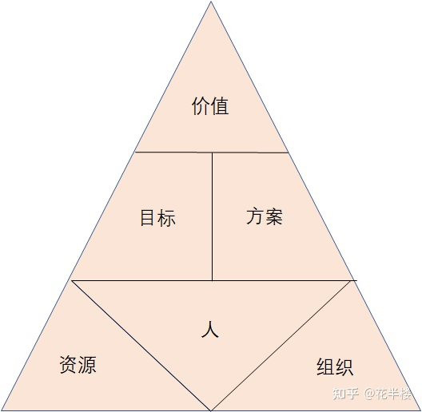

# 架构设计思考

## 架构设计框架

## 详细说明

框架也是按照常规的金字塔形式组织，从宏观、抽象逐渐到微观、具体，但不陷入细节。
在此思维逻辑的基础上，每个板块不需要像其他框架那样进一步进行细分，以增加可执行性。
我是在每个板块上添加约束，知道每一步需要注意的点是什么，而具体执行的策略则因人而异。
在每个板块上添加一个必选、可选的约束，必选是必须达成的，否则效果大打折扣。

我们接下来详细分解。

### 1. 价值
价值最重要的约束是：
- 定义问题 - 必选
- 解决必要性 - 必选

问题必须 能定义，一个问题如果没法定义，那么就没法解决。定义问题是最难的，是高阶能力，也是一个职场人逐渐走上高位必须具备的能力。
问题是否明确定义的标准是否能量化。
一开始不能量化没关系，重要的是要用可量化的描述来看问题。
很多人思考价值时一上来就喜欢从 商业价值或者技术价值角度来定性描述，这样写没问题，但这一定是在走向明确定义问题的路途上做的。定性描述是过程，定量描述才是最终目标。
问题定义清楚后，就很容易的阐述清楚解决这个问题会对用户、对自己、对竞争对手将会产生什么样的影响，说服力极强。

解决必要性说的是即使问题能够明确定义，但当必要性不足时也不要去解决，需要解决的问题才有价值。不要提前做必要性不足的问题，即使未来明确知道必须要做也不要去做，否则价值无法体现。

### 2. 目标
目标是为实现价值必须达到的一些指标，与价值最大的区别是目标是给自己或内部人看的。
目标的约束条件是：
- 量化 - 必选
- 达成共识 - 必选

目标量化是为了牵引行动，没有目标必然陷入迷茫。

达成共识是为了减少内耗与迷茫，在任何行动开始之前，必须反复讨论目标。要兼顾多方利益，以求目标真正的达成共识，必要时需要放弃部分个人利益，以达成共识。

### 3. 方案
方案是我们要达到目标进行行动的具体策略。
方案的约束条件是：
- 可执行 - 必选
- 有备案 - 必选
- 可迭代 - 可选

可执行是做方案的第一考虑要素。
有时候为了方案的可执行，甚至需要降低目标。切不可为了目标而建立执行难度很高的方案。
任何的目标，如果难以执行，往往会导致执行动作的变形，最终导致目标的偏差甚至中途放弃。这时反而不如降低目标，建立执行起来更简单的方案。

有备案说的是，不要理想化任何一个执行动作，现实的荒诞和不可理解性往往会在你认为没有任何问题时给你卡住，导致无法继续执行。所以，我们设计方案时往往要避免强依赖单个节点，也即要设计多条可达通路。

可迭代是可选的，但我们考虑行动方案时最好要考虑这一点，因为任何好的方案都是迭代出来的，不是设计出来的。方案执行完成，我们可能会发现没有达到目标，那么需要对方案进行升级迭代。这就要求我们设计方案时要避免多方在多路径上出现，此时最好是进行拆解，每一部分可以独立执行，或者依赖尽量少。

### 4. 资源
巧妇难为无米之炊，没有资源啥也干不了。
资源的约束条件是：
- 可控 - 必选

资源这里只有一个必须要求，必须是可控的。不可控的资源必须可拆卸，对最终价值产生影响必须较小，否则宁可不用。

### 5. 组织
任何稍微大一点、难一点的问题，都不是独立个体能完成的，我们必须借助组织的力量。在当今社会，不会利用组织力量的人，很难做成影响力大的事。
组织的约束条件是：
- 共同利益 - 必选
- 情感联系 - 可选

建立组织的核心要义是明确共同利益，有共同利益才能形成凝聚力。

情感联系是可选的，足够强的共同利益足够保证组织的稳定了，加上情感联系可以共同利益临时分歧时，来维持一定的稳定。但万万不可将情感联系凌驾于共同利益之上，情感联系破裂产生的反噬远远高于共同利益的消失。

### 6. 人
人是金字塔基座的核心，所有的价值和目标都需要靠人来实现。
人太复杂了，与人打交道很难说哪种方式真的正确、永远正确，所以这里留空了，大家自行思考总结。

